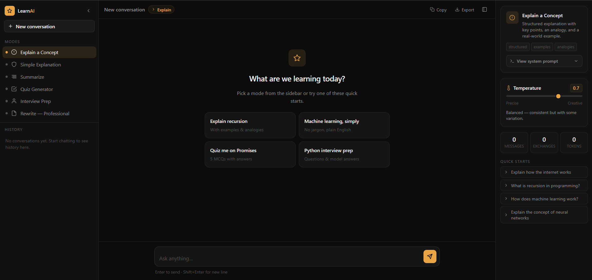
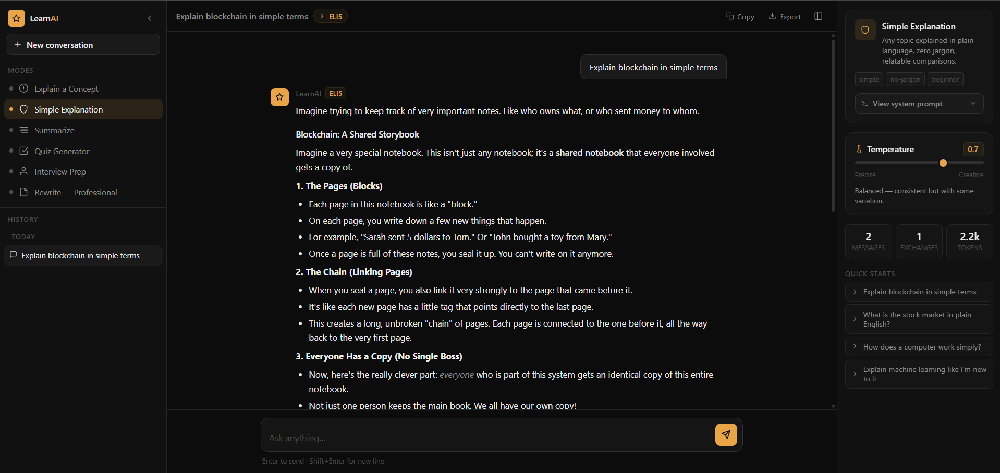

# LearnAI Version2

## Application Preview

### Home Interface



### AI Response Example



---

## Overview

LearnAI Version2 is an AI-powered learning assistant built using the Google Gemini API. Developed as part of Task 2, the application extends a basic AI chatbot through advanced prompt engineering, multiple learning modes, temperature controls, quick-start prompts, and conversation management.

The system demonstrates how prompt engineering and modern web technologies can be combined to create a more effective and interactive educational AI application.

---

## Live Demo

**Application:**  
https://learnai-version2-prompt-engineering.onrender.com/

**Source Code:**  
https://github.com/RutujN/LearnAI_Version2-Prompt-Engineering

---

## Features

### Learning Modes

- Explain a Concept
- ELI5 (Explain Like I'm Five)
- Summarize
- Quiz Generator
- Interview Preparation
- Professional Rewrite

### Advanced Prompt Engineering

- Dedicated system prompts for each learning mode
- Structured and learning-focused AI responses
- Consistent output formatting
- Mode-specific behavior and response generation

### AI Controls

- Adjustable temperature settings
- Control creativity and response style
- System prompt visibility for transparency

### Quick Start Prompts

- Pre-built prompts for common learning tasks
- Faster interaction and easier onboarding
- Guided learning experience

### Conversation Management

- Persistent chat history
- Multiple learning sessions
- Continue previous conversations

### Modern User Experience

- Responsive design
- Sidebar navigation
- Markdown-rendered responses
- Copy and export responses
- Clean and intuitive dashboard

---

## Task 2 Requirements Fulfillment

| Task 2 Requirement | Implementation |
|-------------------|----------------|
| Prompt Engineering | Custom system prompts for Explain, ELI5, Summarize, Quiz Generator, Interview Prep, and Professional Rewrite modes |
| Enhanced AI Functionality | Multiple specialized learning modes with structured responses |
| User Input Handling | Interactive chat interface for natural language queries |
| LLM Integration | Google Gemini 2.5 Flash API |
| Response Customization | Adjustable temperature settings for controlling creativity and response style |
| Improved User Experience | Modern responsive dashboard, sidebar navigation, and markdown-rendered responses |
| Quick Start Prompts | Pre-built prompts that guide users and demonstrate effective prompting techniques |
| Conversation Management | Persistent chat history and multi-session support |
| Frontend Development | HTML5, CSS3, and JavaScript (ES6 Modules) |
| Backend Development | Node.js and Express.js API integration |
| Deployment | Public deployment on Render |

---

## Technology Stack

### Frontend

- HTML5
- CSS3
- JavaScript (ES6 Modules)

### Backend

- Node.js
- Express.js

### AI Integration

- Google Gemini 2.5 Flash API

### Deployment & Version Control

- Git
- GitHub
- Render

---

## System Workflow

```text
User Input
     ↓
Learning Mode Selection
     ↓
Custom System Prompt
     ↓
Node.js + Express Backend
     ↓
Google Gemini API
     ↓
Structured AI Response
     ↓
Frontend Display
```

---

## Project Structure

```text
LearnAI_Version2-Prompt-Engineering/
│
├── public/
│   ├── css/
│   │   └── style.css
│   │
│   ├── js/
│   │   ├── app.js
│   │   ├── chat.js
│   │   ├── modes.js
│   │   └── ui.js
│   │
│   └── index.html
│
├── routes/
│   └── chat.js
│
├── server.js
├── package.json
├── package-lock.json
└── .gitignore
```

---

## Installation

### Clone the Repository

```bash
git clone https://github.com/RutujN/LearnAI_Version2-Prompt-Engineering.git

cd LearnAI_Version2-Prompt-Engineering
```

### Install Dependencies

```bash
npm install
```

### Configure Environment Variables

Create a `.env` file:

```env
GEMINI_API_KEY=YOUR_API_KEY
```

### Run the Application

```bash
npm start
```

Open:

```text
http://localhost:3000
```

---

## Security

API credentials are securely stored using environment variables and are never exposed to the client-side application.

```env
GEMINI_API_KEY=YOUR_API_KEY
```

---

## Future Improvements

- Multi-model comparison mode
- Voice interaction
- File upload and document analysis
- AI-generated flashcards
- Study planner generation
- Cloud-synced conversations
- Custom AI modes

---

## Author

**Rutuj N.**

GitHub: https://github.com/RutujN

Project Repository: https://github.com/RutujN/LearnAI_Version2-Prompt-Engineering